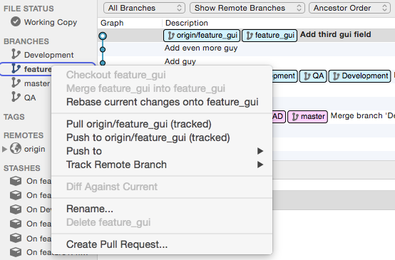
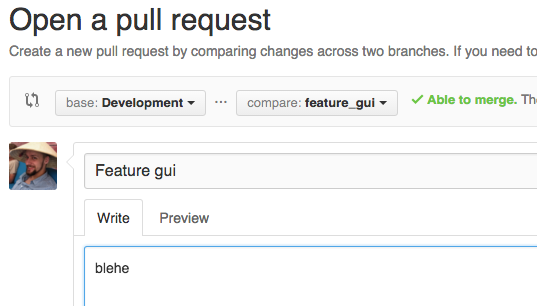
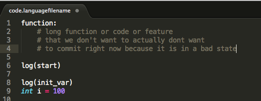
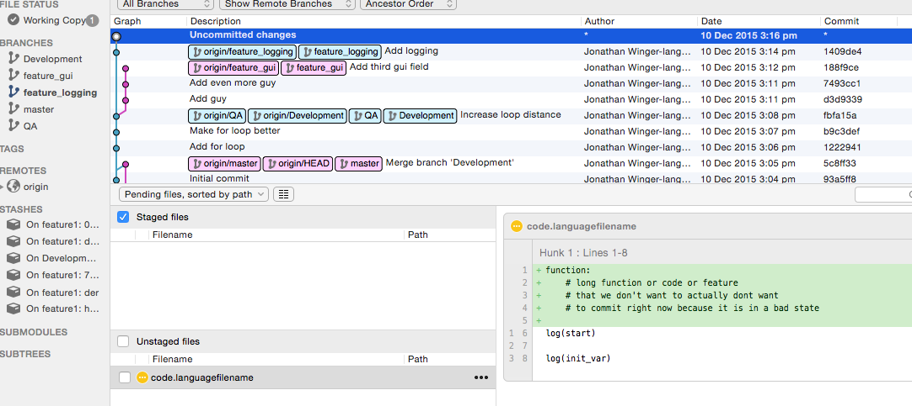
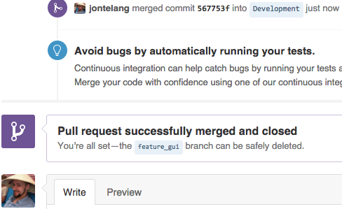
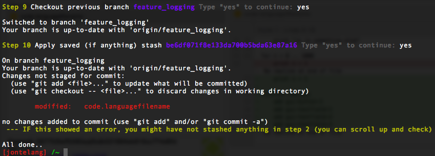

From the script itself:

## Use case

You are in the middle of coding and QA wants new stuff that are on development branch. Example after a pull request was merged. This script will then save your current state (stash+current branch), checkout and pull development branch so that you're up to date from origin, do the same for qa branch (pull origin), then merge the new stuff from development branch into the qa branch and push it up. Then it will restore your state (stash+branch). All in less than 30 seconds.

## What will happen

In this example I've set the following vars

`BRANCH_TO_MERGE_FROM` = Development-branch  
`BRANCH_TO_MERGE_INTO` = QA-branch  
`REPO_DIR` = /dir/to/repo

1. CD to your project folder (`/dir/to/repo`)
2. Stash any temporary work in a new stash
2.5 Save the current branch name (so we can go back automatically)
3. Checkout `Development-branch` branch
4. Pull `Development-branch` branch to ensure up-to-dateness
5. Checkout `QA-branch` branch
6. Pull `QA-branch` branch to ensure up-to-dateness
7. Merge `Development-branch` INTO `QA-branch`
8. Push `QA-branch` to origin/`QA-branch`
9. Checkout the previous/saved/working branch from step 2.5
10. Apply the saved stash

## How it looks like in action

**We have jut finished a new feature.**  
  

**Create a pull request into `Development-branch`**  
  

**Same  
**  

**We've now started work on a new feature.**  
  

**Right in the middle of working...**  
  

<!-- **(Same, uncommitted stuff..**  
   -->

**...the previous PR was merged. And QA-team wants to QA the newly merged feature. But we're right in the middle of working and context switching is never nice.**  
  

**You can see here that the feature_gui is merged into origin/Development. Now QA wants their origin/Development to be up to date.  

**QA Dance script booting up**    
  

**It goes to the folder within the script (no need to cd yourself)**  
  

**Since we were in the middle of a new feature and coding, it stashes it in a named stash for later.**  
  

**We check out the Development-branch and pull down the origin stuff. It is now up to date with the PR'd code.**  
  

**As you can see here.**  
  

**We do the same for the QA branch just in case.**  
  

**We merge the new changes that came from PR > origin/development > development into the local QA branch.**  
  

**As you see they are all now up to date.**  
  

**.. So we push it to the origin/QA**  
  

**Pushing..**  
  

**Now it is all up to date.**  
  

**Remember that we were in the middle of coding. We checkout the previous branch and un-stash the changes that we were working o**n.  
  

**Ta-da, the code we were working on is back and the QAs branch is up to date with the development after the PR.**  
  
